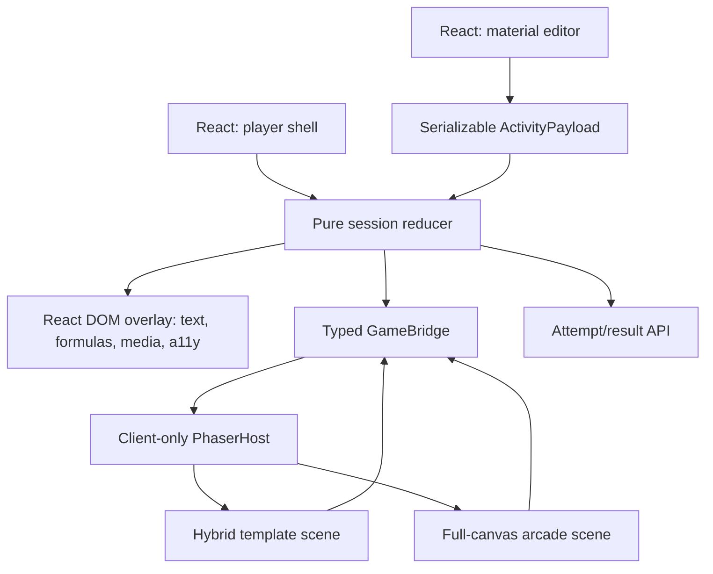

# Technical plan for a game MVP on Phaser 4

The current food queue as of October 8, 2026 is maintained in the [island game plan](ISLAND_GAMES_IMPLEMENTATION_PLAN.md). This document describes the previous technical phase and does not require starting a new phase with a complete migration of running games; The suitability of existing code is checked first.

Recording date: July 31, 2026.  
Status: runtime foundation and renderer code of all six basic templates are implemented; “Couples” and “Groups” have passed browser QA, and frame-by-frame testing is underway for four new scenes. Visual confirmation of direction and production-gates remain open.  
Main decision: Next.js 16 + React 19 + TypeScript remain the platform; Phaser 4.2.1 becomes the only gaming runtime.

## 1. Goal

Completely replace the current gaming frontend, which is assembled from disparate DOM/CSS/SVG components, with a single modern gaming system. Existing training data, validation rules, results, edit fields, image uploads, and APIs are preserved.

The first vertical slice is “Couples”. He must prove simultaneously:

- visual quality level approved `docs/games/match-pairs/mockup-desktop-v3.png`;
- reuse of arbitrary tutor content;
- stable React ↔ Phaser lifecycle;
- desktop, mobile, keyboard and reduced-motion modes;
- the ability to transfer the same runtime to other templates and full-fledged arcade games.

Until we pass this threshold, we do not expand authorization, payment, analytics and server infrastructure.

## 2. What do we keep and what do we replace?

### 2.1. Canonical logic - preserved

These files are the source of truth and are not rewritten for graphics:

```text
lib/activity-runtime.ts
lib/editor-runtime.ts
lib/learning-media.ts
lib/visual-themes.ts
lib/force-lab.ts
lib/mistake-arena.ts
lib/match-pairs.ts
lib/group-sort.ts
lib/quiz-rush.ts
lib/recall-deck.ts
lib/activity-api.ts
lib/attempt-api.ts
app/api/**
```

Only testable extraction of duplicate transition functions from React components into clean ones is allowed `lib`-functions. Format of existing saved files `level` does not change without versioned adapter.

### 2.2. Game Performance - Replaced

After the migration of the corresponding game, the following are deleted or completely rewritten:

```text
components/student-play-screen.tsx # new player shell and session composition
components/learning-studio.tsx # only the connection point for the new preview
components/force-lab-canvas.tsx
components/mistake-arena-canvas.tsx
components/match-pairs-canvas.tsx
components/group-sort-canvas.tsx
components/quiz-rush-stage.tsx
components/recall-deck-stage.tsx
components/game-effects.tsx
components/game-option-wheel.tsx
game blocks app/lab.css
```

`activity-editor.tsx` is not rewritten at the first game stage. Its fields and live data are preserved, only the renderer preview changes.

### 2.3. Time Compatibility

The old renderer remains fallback until the new pilot passes. There is one migration switch per game, rather than two permanently supported implementations:

```ts
type RendererVersion = 'legacy' | 'phaser-v1'
```

After passing the acceptance gate `legacy` for this game is removed along with unused CSS.

## 3. Target architecture



### 3.1. Source of truth

- `ActivityPayload` contains only serializable existing level data and theme id.
- A pure session reducer determines correctness, progress, accuracy and completion.
- Phaser owns only high-frequency visual state: pointer trajectory, particles, camera, transient tweens, audio instances.
- React doesn't get it `pointermove` and particle coordinates each frame.
- Phaser does not calculate the correct answer on its own.
- In React, only semantic events are returned: `attempt`, `correct`, `wrong`, `complete`, `pause-request`, `runtime-error`.

### 3.2. Two modes of one runtime

**Hybrid template** is used for “Pairs”, quizzes, cards, text and formulas:

- Phaser: world, light, lines, corgi, particles, camera impulse, sound;
- DOM: educational text, formulas, custom images, focus and screen reader;
- DOM and Phaser use the same container local coordinate system.

**Full canvas arcade** used for runner/physics/action mechanics:

- Phaser owns the playfield and input;
- React leaves the external HUD, pause, accessibility summary and result overlay;
- the result still goes through the general session contract.

## 4. Target file structure

On the first slice, only the necessary structure is created:

```text
components/
  game-runtime/
    phaser-host.tsx
    game-stage.tsx
    game-error-fallback.tsx
  games/
    match-pairs/
      match-pairs-game.tsx
      match-pairs-overlay.tsx
      match-pairs-scene.ts
      match-pairs.module.css
lib/
  game-runtime/
    contracts.ts
    bridge.ts
    coordinate-space.ts
    renderer-registry.ts
    theme-manifest.ts
  game-sessions/
    match-pairs-session.ts
public/
  game-assets/
    common/
    themes/
      corgi-classic/
      deep-sea/
```

Catalogs for other games are not created in advance. They appear at the beginning of the corresponding vertical cut.

## 5. Runtime contracts

### 5.1. Payload

```ts
type ActivityPayload = {
  activityId: string
  gameId: GameId
  level: EditableLevel
  themeId: VisualThemeId
  seed: number
  mode: 'player' | 'preview'
}
```

`seed` provides repeatable card order and decorative randomness. AI does not control coordinates, colors or speed.

### 5.2. React Commands → Phaser

```ts
type GameCommand =
  | { type: 'runtime/load'; payload: ActivityPayload }
  | { type: 'runtime/content-patch'; payload: ActivityPayload }
  | { type: 'runtime/theme-patch'; themeId: VisualThemeId }
  | { type: 'runtime/pause' }
  | { type: 'runtime/resume' }
  | { type: 'runtime/reduced-motion'; enabled: boolean }
  | { type: 'runtime/destroy' }
  | { type: 'match/layout'; layout: MatchPairsLayout }
  | { type: 'match/drag'; state: MatchDragVisualState }
  | { type: 'match/correct'; connection: MatchConnectionVisual }
  | { type: 'match/wrong'; connection: MatchConnectionVisual }
  | { type: 'match/complete' }
```

### 5.3. Phaser Events → React

```ts
type GameEvent =
  | { type: 'runtime/ready' }
  | { type: 'runtime/error'; message: string; recoverable: boolean }
  | { type: 'runtime/perf'; fps: number }
  | { type: 'game/action'; action: GameAction }
  | { type: 'game/complete-animation-finished' }
```

Bridge scoped to a specific host. The global singleton EventBus is prohibited: it creates duplicate events with Next navigation and React Strict Mode.

### 5.4. Renderer registry

```ts
type RendererKind = 'dom' | 'phaser-hybrid' | 'phaser-full'

type RendererDefinition = {
  gameId: GameId
  version: RendererVersion
  kind: RendererKind
  load: () => Promise<React.ComponentType<GameStageProps>>
}
```

Registry doesn't hide game differences. It only solves lazy loading and renderer selection.

Current `lib/game-runtime/renderer-registry.ts` for now it is only a declarative table and is not used by production consumers. Before removing any legacy renderer, this section must be implemented as a real mount point for `StudentPlayScreen`, `LearningStudio` and `ActivityEditor`.

## 6. Phaser lifecycle

### 6.1. Creation

- `phaser` imported only within the client boundary;
- in module scope and server component there is no call to `window`, WebGL and Phaser singleton;
- `new Phaser.Game()` called once every `useEffect` after the appearance of the local parent container;
- Phaser version is fixed as `4.2.1`, without `^`;
- production renderer - WebGL with transparent canvas for hybrid scene;
- `resolution = min(devicePixelRatio, 2)`;
- resize is tied to the container, not to `window`.

### 6.2. Update

- changing text/image in preview sends `content-patch`, and does not recreate `Phaser.Game`;
- theme patch replaces only theme-owned assets;
- level id/structural change can restart the Scene, but not the entire runtime;
- one visible player contains one Phaser canvas;
- preview runtime runs only when preview is visible.

### 6.3. Pause and background

- `running=false`, `document.hidden` and pause overlay stop scene update, emitters and sound;
- returning to the tab does not catch up with lost time in physics;
- the training timer belongs to session, not Phaser clock;
- reduced motion disables camera movement, traveling particles and parallax, preserving static states.

### 6.4. Destruction

When unmount the following are required:

1. scene shutdown;
2. removing input/listener/timer/audio subscriptions;
3. destroying dynamic textures and object URLs owned by the scene;
4. `game.destroy(true)`;
5. bridge cleaning;
6. removing canvas from parent if Phaser didn't do it itself.

Strict Mode should not create two live instances.

## 7. DOM coordinates ↔ Phaser

Hybrid scene uses the logical coordinates of the local game container:

```ts
type LocalPoint = { x: number; y: number }

localX = clientX - containerRect.left
localY = clientY - containerRect.top
```

- DOM cards publish anchor points every other `ResizeObserver`;
- points are transmitted by command `match/layout` after layout/resize/font/media load;
- Phaser camera and canvas match the CSS size of the container;
- The CSS transform of the scaled editor preview is taken into account through the actual `getBoundingClientRect`;
- no independent “lookalike” mesh calculation inside Phaser;
- The drag endpoint lives in Phaser, but hit testing of available cards remains in the DOM for the hybrid MVP.

## 8. Theme and asset pipeline

### 8.1. ThemeManifest

```ts
type ThemeManifest = {
  id: VisualThemeId
  version: number
  palette: ThemePalette
  background: ThemeLayer[]
  foreground: ThemeLayer[]
  particles: ParticlePreset[]
  sounds: Partial<Record<GameSoundId, string>>
  mascot: MascotAsset
  motion: ThemeMotionProfile
}
```

### 8.2. Composition of art kit

One theme is not a color filter. Minimum set:

- background without built-in UI and text;
- 2–4 transparent depth layers;
- foreground props on the edges;
- particle textures;
- 5–7 corgi states or temporary sprite sheet;
- `tap`, `lift`, `correct`, `wrong`, `complete` sounds;
- static/reduced fallback.

The first pilot checks two different topics:

1. `corgi-classic` — light, airy, turquoise interactive accents;
2. `deep-sea` — approved immersive composition.

This way we immediately prove that the platform does not turn into a set of games “only with water”.

### 8.3. Custom images

- in hybrid MVP, custom images remain DOM `` through `LearningImageView`;
- Phaser does not decode data URLs unless necessary;
- loading errors show a clear placeholder and do not break the scene;
- the future canvas arcade game receives images through the owned texture registry;
- the object is released only by the owner after completion of use;
- production storage later replaces the data URL with the S3/R2 URL without changing the Level schema.

### 8.4. Origin of assets

Every external or created asset has a record of: source, license, author/model, date, purpose, and transformations. You cannot copy ready-made theme packages without checking the license.

## 9. Pilot "Pair"

### 9.1. Saved contract

The following work without migration:

- `MatchPairsLevel`;
- `MatchPair.left/right`;
- `visual`, `leftMedia`, `rightMedia`;
- `MatchConnection`;
- `getMatchPairsResult()`;
- editor builder and AI JSON;
- existing saved activities.

### 9.2. New player layout

- fullscreen game composition without left mission-panel and right control-panel;
- compact top HUD: exit, title/instruction, progress, pause/sound;
- two columns of four large cards;
- central connection zone;
- the corgi is integrated into the composition, but does not overwhelm the task;
- result overlay appears inside the world;
- editor preview shows the same scene in scale mode, and not a separate stylization.

### 9.3. States

```text
boot → intro → ready → selecting → targeting → checking
checking → correct → ready
checking → wrong → ready
correct → complete, if all pairs are collected
ready/targeting → paused → ready
runtime-error → DOM fallback
```

### 9.4. Motion recipes

- intro: background depth, HUD and cards are included in separate stagger groups;
- selection: the card is raised by 4–6 px, the node is revealed, the targets are strengthened;
- drag: elastic multi-layer line and travelling highlight;
- target: magnetic halo appears before release;
- correct: snap, green wave, short burst, progress choreography, corgi reaction;
- wrong: coral line, opposing recoil and spring return for 250–320 ms;
- complete: the lines are assembled into a composition, the corgi reacts, the result overlay enters after the end of the action;
- reduced motion: same states via outline, color, icon and opacity without camera/particle movement.

### 9.5. Mobile

At widths up to 680 px, focus mode is used:

- one original card;
- 3–4 large answers;
- tap-first input;
- progress and pause in the top HUD;
- desktop drag is optional;
- the composition retains the theme and corgi, but removes the secondary foreground;
- safe-area takes into account iOS browser chrome.

## 10. Productivity

### 10.1. Code and download budget

- Phaser is loaded as a separate client-only chunk only on the player/visible preview;
- Phaser runtime target size: no more than 400 KB gzip;
- essential assets of the first scene: up to 1.5 MB desktop and up to 900 KB mobile;
- optional foreground/audio are loaded after the job is ready;
- no more than one WebGL canvas per visible player;
- DPR is not higher than 2.

### 10.2. Runtime budget

- desktop median ≥58 FPS;
- average Android median ≥50 FPS;
- the budget phone does not systematically drop below 30 FPS;
- no regular main-thread stalls >50 ms;
- no more than 40 event particles simultaneously in the base template;
- permanent emitters have a device-tier cap;
- hidden scene does not execute the active render loop.

### 10.3. Memory

- 20 transitions player → studio → player leave one active canvas;
- after 10 material changes, the number of theme textures/audio instances returns to baseline;
- preview patch does not accumulate object URLs;
- WebGL context loss leads to fallback/recovery without loss of session state.

## 11. Test strategy

### 11.1. Unit

- golden fixtures for each existing level JSON;
- old and new session transitions give the same correct/wrong/progress/result;
- seeded shuffle playable;
- coordinate conversion is checked separately;
- bridge subscribe/unsubscribe does not duplicate events.

### 11.2. Integration

- PhaserHost creates one game instance;
- Strict Mode mount/unmount does not leave canvas;
- `content-patch` does not recreate runtime;
- pause/resume synchronizes scene and session timer;
- runtime error enables DOM fallback.

### 11.3. E2E and visual

Conditions checked:

- intro;
- idle;
- selected/targeting;
- correct;
- wrong;
- complete;
- paused;
- media loading/error;
- mobile focus;
- reduced motion.

Viewport: 360×640, 390×844, tablet, 1366×768, 1920×1080.  
Input: mouse, touch and keyboard.  
Content: short/long Russian, English, formulas, text-only, image-only, image+caption.

## 12. Implementation stages and gates

### Stage 0 - decision and boundaries

- [x] compare engines;
- [x] select Next/React + Phaser 4.2.1;
- [x] allow complete rewrite of game frontend;
- [x] capture persisted domain logic.

### Stage 1 - runtime foundation

- [x] install and securely secure Phaser 4.2.1;
- [x] add test runner for pure contracts;
- [x] create scoped typed bridge;
- [x] create client-only PhaserHost;
- [x] implement pause/resume/resize/destroy;
- [x] add runtime error boundary and DOM fallback;
- [x] check build, lint and lifecycle smoke.

Gate: one transparent Phaser canvas stably lives and is destroyed inside the Next player without changing the training logic.

### Stage 2 - session and adapter “Steam”

- [x] collect golden fixtures;
- [x] extract a single pure transition for connection attempt;
- [x] connect both student player and studio to one session adapter;
- [x] save old result contract;
- [x] add renderer flag `phaser-v1`.

Gate: the old and new paths give the same attempts, connections, accuracy and completion.

### Stage 3 - art kit and visual reference implementation

- [x] prepare individual layers `corgi-classic` and `deep-sea`;
- [x] approve normal corgi and states `idle/focus/drag/correct/wrong/complete`;
- [x] create a new fullscreen player shell;
- [x] implement Phaser ambience and DOM overlay cards;
- [x] implement magnetic line, correct/wrong/complete sequences;
- [x] add local sound kit `tap/drag/correct/wrong/complete` with mute and lifecycle;
- [x] implement reduced motion without losing the clarity of states.

Gate: desktop screenshot undergoes manual comparison with an approved reference; the user confirms the direction.

### Stage 4 – production QA “Steam”

- [x] desktop, mobile focus-mode and keyboard flow;
- [ ] real touch-drag on a mobile device;
- [ ] custom images and long content;
- [ ] performance and memory profile;
- [x] editor live preview without re-creating the Phaser canvas;
- [x] production lifecycle: one canvas, pause/resume and complete destroy when changing games;
- [x] clean production console without errors and warnings;
- [x] attempt API, including automatic retry after offline failure;
- [x] API restrictions: 2–8 pairs, up to 160 characters, unique pair id;
- [x] visual regression screenshots for idle/selected/correct/wrong/complete/mobile/deep-sea;
- [ ] remove the legacy renderer and its CSS after passing the gate.

Gate: “Pairs” complies with the Definition of Done and becomes the standard of the platform.

### Stage 5 - general primitives

- [ ] turn the renderer registry into a real lazy mount point for Student, Studio and Editor;
- [ ] remove manual triple branching of renderers after checking the adapter;
- [ ] highlight only proven ones `GameShell`, `ThemeWorld`, `GameHUD`, `FeedbackFX`, `MascotController`, `SoundManager`;
- [ ] do not transfer the “Steam” layout to other mechanics;
- [ ] document semantic events and device tiers;
- [ ] check two topics on the same game.

### Stage 6 - remaining base games

Each one goes through a separate cycle. `SPEC → visual reference → approval → renderer → QA`:

1. "Groups":
   - [x] light reference `design-references/group-sort/group-sort-light-arcade-v2.png` and motion spec;
   - [x] hybrid Phaser renderer: native curve, target choreography, pooled particles, responsive `RESIZE`;
   - [x] single props contract and connection in Student, Studio and Editor;
   - [x] browser QA: desktop idle/wrong/correct, mobile layout, one Phaser canvas, clean console;
   - [ ] physical touch-device, custom image and reduced-motion smoke;
   - [ ] visual user confirmation and removal of legacy renderer/CSS;
2. "Blitz quiz":
   - [x] separate light-arcade reference;
   - [x] hybrid renderer: DOM answers + native Bézier energy flight + pooled particles;
   - [x] single props contract and connection in Student, Studio and Editor;
   - [x] browser QA desktop/mobile/correct/wrong/advance, one canvas and clean console;
3. "Memory Deck":
   - [x] separate light-arcade reference;
   - [x] hybrid renderer: available DOM card + Phaser deck/trays/flight/particles;
   - [x] single props contract and connection in Student, Studio and Editor;
   - [ ] browser QA reveal/rating/keyboard/mobile;
4. "Find the error":
   - [x] separate light-arcade reference;
   - [x] hybrid renderer: DOM-hotspots + Phaser scanner/spotlight/impact feedback;
   - [x] single props contract and connection in Student, Studio and Editor;
   - [ ] browser QA correct/wrong/keyboard/mobile;
5. "Laboratory of Forces":
   - [x] separate light-arcade reference;
   - [x] hybrid renderer: Phaser vector/target/rover/gate + exact DOM readout/keyboard;
   - [x] single props contract and connection in Student, Studio and Editor;
   - [ ] browser QA pointer/keyboard/completion/mobile.

The Legacy renderer is being removed one game at a time, rather than in one massive commit.

Verified external references, official Phaser building blocks and motion map of all six games: `docs/GAME_ENGINE_REFERENCE_MATRIX.md`.

### Stage 7 - First Arcade

- full-canvas `Portal Rush` on the existing quiz content family;
- Phaser camera, physics/input, audio and arcade feedback;
- React HUD and session result contract;
- desktop/mobile/performance QA;
- no new incompatible learning content formats.

## 13. Definition of Done gaming MVP

- six base games have been migrated to the new runtime and visually adopted;
- one full-canvas arcade game uses the existing content family;
- old saved activities work without manual migration;
- Tutor images are supported in all suitable slots;
- at least two themes really change the art direction, and not just the palette;
- player works on desktop and mobile, mouse/touch/keyboard;
- reduced motion keeps the passage clear;
- there are no two active canvases, texture/audio leaks and duplicate listeners;
- attempt/result API retains the previous contract;
- unit, integration, E2E, lint and production build pass;
- legacy game CSS and components removed after migration of the last game.

## 14. Plan execution rule

The next stage begins only after the gate of the previous one. If the visual reference is not accepted, the renderer does not scale to other games. If lifecycle or logical parity is not proven, the legacy component is not removed. Any change to the content schema is formalized as a separate versioned migration, and is not hidden inside the Phaser Scene.
