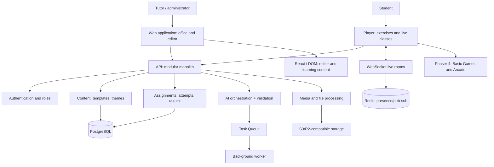
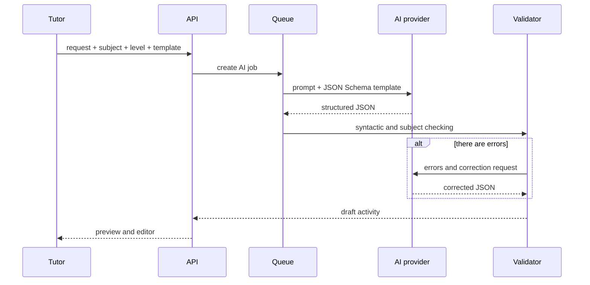

# Technical architecture and development plan for the simulator platform

## 1. Purpose of the document

This document describes the target architecture of a web platform for tutors in various subjects. The platform allows you to quickly create interactive exercises, distribute them to students, conduct live classes, track progress, and use AI to prepare **testable learning content**.

The current implementation of the search library, AI outline, geometric SVG diagrams and visual worlds is recorded separately in [CONTENT_LIBRARY_AND_THEMES.md](./CONTENT_LIBRARY_AND_THEMES.md). The architecture of mass filling of tasks through allowed sources, PixelRAG, mathematical verification and the methodologist queue is described in [PIXELRAG_CONTENT_PIPELINE.md](./PIXELRAG_CONTENT_PIPELINE.md).

A separate runtime of short subject training, its current coverage and expansion order are described in [LIGHT_TRAINERS_PLAN.md](./LIGHT_TRAINERS_PLAN.md). It develops alongside game patterns, but does not replace them.

The solution to a single Phaser-runtime, comparison of current open-source engines and the boundary between the DOM and the game scene are recorded in [GAME_ENGINE_DECISION.md](./GAME_ENGINE_DECISION.md). Step-by-step implementation of the game MVP is carried out according to [PHASER_MVP_IMPLEMENTATION_PLAN.md](./PHASER_MVP_IMPLEMENTATION_PLAN.md).

The goal is to combine the speed of Wordwall with the visual quality of a modern gaming platform and normal UX for children, teenagers and adult learners.

### Working assumptions

- The main audience is private tutors, small training centers and their students.
- Main modes: individual lesson, mini-group and independent home practice.
- Subjects: languages, mathematics, physics, chemistry, humanities, exam preparation.
- Web-first platform: should work on laptops, tablets and phones without installing an app.
- Adult learners are a valuable audience, especially for English, job skills and interview preparation.
- AI doesn't write game code. It generates or transforms only structured exercise data.
- The first release is being built as a modular monolith. Microservices are not needed until real workload and individual teams appear.

## 2. Product model

### Roles

| Role | Opportunities |
| --- | --- |
| Tutor | Creates materials, starts classes, assigns homework, sees analytics. |
| Student | Goes through the exercises, connects to a live lesson using a code, and sees personal progress. |
| Center Administrator | Manages tutors, general materials, tariffs and accesses. |
| Methodist (later) | Creates proven templates and content sets for the catalog. |

### Main object: activity

`Activity` is not a game or a set of HTML pages. This is educational material tied to one or more presentation methods.

```text
Material Source → Typed Content → Exercise Template → Visual Theme → Run/Try
```

Example: tutor introduces pairs `term - definition`. The same content can open as:

- matching;
- cards;
- speed sort;
- memory;
- quiz with automatically selected distractors;
- arcade mode, if the volume and data structure are suitable.

This fundamentally distinguishes the platform from a set of independent mini-games.

## 3. Architectural principles

1. **Content is separate from the game.** Training data is stored in canonical format; the template only displays and checks them.
2. **The template is separate from the theme.** One game can have children's, teen, editorial and professional themes without duplicating code.
3. **AI is limited by contract.** Generation goes through JSON Schema, server-side validation and mandatory tutor preview.
4. **Basic exercises - first-class citizens.** Quiz, pairing, sorting, answer keying and skipping should be as polished as arcade games.
5. **Game speed does not equal knowledge.** For subjects and adult students, quiet modes, scenarios, explanation of errors and a mode without a timer are needed.
6. **The server is the source of truth.** Fast effects and local state are allowed on the client, but attempts, points, accesses and results are confirmed by the server.
7. **Accessibility is required.** Keyboard, screen readers for DOM exercises, contrast, reduced motion mode, subtitles and the absence of critical color-only signals.

## 4. High level diagram



## 5. Technology stack

### Basic selection

| Layer | Solution | Reason |
| --- | --- | --- |
| Monorepository | pnpm workspaces + Turborepo | Common types, UI, schemas and game packages without publishing internal npm packages. |
| Frontend | Next.js + React + TypeScript | Cabinet, SSR for public pages, strong ecosystem of forms and UI. |
| API | Fastify/NestJS on TypeScript | Fast development, strict DTOs, WebSocket and a common language with the frontend. |
| DB | PostgreSQL | Transactions, reliable connections, JSONB for content, full-text search. |
| ORM | Drizzle or Prisma | Migrations, type-safe queries, transparent data schema. |
| Cache and real-time | Redis | Presence, pub/sub, rate limit, background queues. |
| Queues | BullMQ | AI generation, file import, PDF export, analytics recalculation. |
| Files | S3 or Cloudflare R2 | Images, audio, attachments and generated content. |
| Basic exercises | React DOM overlay + Phaser 4 | Text, formulas, images, and focus remain accessible; one common game runtime draws the world, lines, particles and characters. |
| Arcade games | Phaser 4 + TypeScript | The same runtime includes cameras, physics, sound and a full game cycle for independent arcade renderers. |
| Staged timelines | Motion; GSAP point | Motion serves regular DOM states, GSAP only serves complex sequences of multiple objects. |
| Character Animations | Rive (if necessary) | Compact interactive state-machine animations. |
| Observability | Sentry + OpenTelemetry | Errors of clients, API and background tasks. |
| Tests | Vitest + Playwright | Unit, integration and end-to-end scenarios. |

### Why not one Canvas for everything?

Quiz, flashcards, text input, formulas, tutor-loaded images and forms remain DOM components: they work better with keyboards, mobile browsers and accessibility. This doesn't mean that base games have to look like regular forms. The Phaser scene works under the DOM content: it draws the game world, light, particles, trajectories, magnetic nodes and event effects.

In basic templates, Phaser works as a presentation/gameplay layer without mandatory physics. In independent arcades, the same runtime controls the camera, physics, opponents, sound and the full game cycle. A separate PixiJS-runtime is not connected to the MVP: one asset pipeline and one lifecycle is simpler and more reliable for a game catalog.

## 6. Repository structure

```text
apps/
  web/ # Next.js: public pages, account, player
  api/ # Fastify/NestJS API and WebSocket gateway
  worker/ # queues: AI, import, export, aggregations

packages/
  domain/ # domain types and rules
  db/ # database schema, migrations, repositories
  ui/ # design system and general React components
  schemas/ # Zod/JSON Schema content and API
  template-sdk/ # exercise template contract
  game-runtime/ # general game state, sound, input, effects
  templates-basic/ # quiz, pairs, sort, cards, cloze, etc.
  templates-arcade/ # Portal Rush, Boss Raid, etc.
  ai/ # prompts, tools, validators, adapters
  analytics/ # unified event dictionary
```

## 7. Domain Model and Data

### Basic Entities

| Entity | Destination |
| --- | --- |
| `workspace` | Tutor or training center; data access boundary. |
| `user` | Adult user account. |
| `student_profile` | Student profile associated with the workspace and, if necessary, with the parent. |
| `subject` / `skill` | Subject, topic, skill, level, exam or CEFR level. |
| `content_document` | Canonical learning content with version and schema version. |
| `activity` | Launch settings: template, theme, rules, visibility. |
| `assignment` | Issuing an activity to one student, a group, or via a link. |
| `attempt` | A specific walkthrough with results and events. |
| `live_room` | Tutor session: connection code, status, participants. |
| `asset` | Image, audio, document, license and metadata. |
| `ai_run` | Input, model, schema, status, validation errors and final draft. |

### Canonical content families

You don't need one giant generic JSON. We need small, strictly defined families:

```ts
type ContentDocument =
  | ListContent // words, elements, cards
  | PairsContent // term - definition, word - translation
  | QuizContent // question, options, correct answers
  | GroupsContent // categories and elements
  | OrderedContent // sequences
  | ClozeContent // text with spaces
  | LabeledImageContent // labels on the image
  | NumericProblemContent
  | DialogueContent // script and branches for language practice
  | OpenResponseContent; // only where there is a review rubric
```

Each document contains:

```json
{
  "kind": "pairs",
  "schemaVersion": 1,
  "title": "Business English: meetings",
  "language": "en",
  "audience": { "level": "B1", "ageBand": "adult" },
  "skills": ["business_english", "meeting_phrases"],
  "payload": {},
  "source": { "type": "manual|ai|import", "references": [] }
}
```

### Versions and safety

- Content is edited through versions: `content_document_version`.
- An Activity always references a specific published version.
- Already started tasks do not change imperceptibly when edited by a tutor.
- You can make a copy, roll back and compare changes.

## 8. Template SDK

Each template is registered as a module, rather than as a separate page with its own storage logic.

```ts
interface TemplateManifest<TContent> {
  id: string;
  version: number;
  title: string;
  category: 'basic' | 'arcade' | 'story';

  acceptedContentKinds: ContentKind[];
  contentSchema: JsonSchema;
  constraints: {
    minItems?: number;
    maxItems?: number;
    supportsImages: boolean;
    supportsAudio: boolean;
    supportsPrint: boolean;
    supportsLiveMode: boolean;
  };

  editor: EditorDefinition;
  validate(content: TContent): ValidationIssue[];
  createSession(content: TContent, settings: TemplateSettings): SessionState;
  score(eventLog: GameEvent[]): AttemptResult;
  render: React.ComponentType<TemplatePlayerProps<TContent>>;
}
```

### Conversion between templates

The conversion is not based on the “any template to any” principle, but through explicit adapters:

```text
pairs → matching / flashcards / memory / quiz
list → wheel / cards / open box
groups → group sort / speed sort
ordered → unjumble / timeline
quiz → quiz / arcade quiz / boss raid
```

If the transformation requires the creation of new knowledge - for example, making a question from a list with incorrect options - it is marked as `AI-assisted` and requires viewing the result.

## 9. Visual system

### The topic is data, not fork games

```ts
interface ThemePack {
  id: 'soft-3d' | 'sticker-arcade' | 'editorial' | 'professional';
  tokens: DesignTokens;
  assets: ThemeAssets;
  motion: MotionProfile;
  sound: SoundProfile;
}
```

Four starting themes:

- `soft-3d`: younger schoolchildren, soft forms and characters;
- `sticker-arcade`: teenagers, stickers, comic dynamics;
- `editorial`: older schoolchildren and adults, expressive typography and calm graphics;
- `professional`: business English, corporate training, minimal decorativeness.

The activity sets the theme, animation intensity, sound, timer mode and interface tone. The tutor can choose them himself or apply a preset by age and subject.

## 10. AI pipeline

### Scenarios

1. “Do 12 tasks on the Past Perfect for adult level B1.”
2. “Use this PDF and do a matching and quiz.”
3. “Make repetition exercises from my set of words.”
4. “Translate the material into English, maintain A2 level.”
5. "Convert term pairs into a dialogue script for an interview."

### Processing thread



### Mandatory checks

- JSON matches the schema;
- the number of jobs is within the template range;
- there is a right answer where it is needed;
- no duplicate options or empty fields;
- HTML and links cleaned up;
- language, level, length and age appropriateness are checked;
- distractors do not contradict the facts;
- for materials from PDF, the source of each fact or fragment is preserved;
- publication never occurs automatically without confirmation from the tutor.

### Don't do it in the first version

- automatic assessment of free essays without a rubric;
- generation of pictures with students’ faces;
- “autonomous agent”, which itself issues tasks to students;
- voice dialogues without explicit consent and clear audio storage policies.

## 11. Live classes and homework

### Live room

The tutor creates a room and receives a short code/link. The room has a server state:

- `lobby` — connecting students;
- `ready` — setting up commands;
- `running` - active exercise;
- `paused` — explanation or discussion;
- `results` - Grand total;
- `closed`.

Only necessary events are transmitted via WebSocket: connection, selection, timer, command status, transition to the next screen. Important results are saved by the HTTP/API transaction after the job completes.

### Modes

- **Tutor-led:** the tutor displays the screen, students answer on their devices.
- **1:1:** two synchronized views, the tutor can highlight an element or open an explanation.
- **Small group:** teams, cooperative and competitive rules.
- **Assignment:** self-execution with deadline, attempt limit and report.

## 12. Analytics

We need not only game statistics, but data for the tutor to decide “what to do in the next lesson.”

### Events

```text
activity_opened
question_shown
answer_submitted
hint_used
answer_checked
activity_completed
assignment_started
assignment_completed
```

### Metrics

- accuracy by skill, topic, question type, and period;
- median response time;
- repeated errors;
- using hints;
- dynamics between attempts;
- progress according to the issued plan;
- for the tutor: what activities are actually used and where students give up.

Leaderboard is an optional layer. For adults and anxious students, it is turned off by default.

## 13. Security, privacy and reliability

- Multitenancy: each request must be filtered by `workspace_id`.
- Roles and rights are checked on the server, and not by hiding buttons on the frontend.
- Short-lived invitation links and room codes.
- Rate limit for login, AI and file uploads.
- Anti-virus scanning of files and restriction of formats.
- Signed links to object storage instead of public bucket URLs.
- Traffic encryption, PostgreSQL backups, recovery verification.
- Audit log: publishing, deleting, exporting, changing rights, AI launch.
- Minimizing children's data; requirements of local legislation and school rules should be clarified before launching in a specific market.

## 14. Productivity and quality

### Budgets

- the first interactive screen - without loading heavy game assets;
- Phaser and heavy themes are loaded dynamically for arcades only;
- images are compressed, responsive options are generated;
- critical actions receive a response from the interface immediately, server confirmation occurs asynchronously;
- offline cache is possible for already opened exercises, but not for live room.

### Testing

| Level | What to check |
| --- | --- |
| Unit | Content validators, adapters, scoring, permissions. |
| Integration | API, transactions, AI queue, file uploading. |
| Contract | Each TemplateManifest accepts valid content and rejects invalid content. |
| E2E | The tutor creates an activity → gives it to the student → the student passes → the report is visible. |
| Visual regression | Main themes, desktop and mobile, reduced motion. |
| Load | Live room with target group size and mass completion of assignments. |

## 15. Phased development plan

### Stage 0: Design and demand verification

**Result:** A consistent vocabulary of items, scripts and first templates.

1. Interviews with 8–12 tutors of different subjects.
2. Choose one main vertical section: for example, English + school mathematics.
3. Define 5-7 basic content types.
4. Create design tokens and 2 starting themes: `soft-3d` and `editorial`.
5. Approve analytics events and rules for working with personal data.

**Verification:** Three tutors can describe the lesson scenario and confirm that it is covered by the selected templates.

### Stage 1. Platform core

**Result:** a safe office for tutor and student.

1. Monorepository, CI, preview/staging/production environments.
2. Authorization, workspace, roles, students and groups.
3. PostgreSQL schema, migrations, object storage.
4. Basic design system: typography, buttons, cards, forms, loading states.
5. Content documents, versions, assets and activities.

**Verification:** the tutor creates a student, a draft of the material and saves the published version.

### Stage 2. Authoring and basic exercises

**Result:** a useful product for daily work without AI and arcade games.

1. Template SDK and schema-driven editors.
2. Templates: Quiz, Flashcards, Matching, Group Sort, Cloze, answer entry.
3. Presets: child / teenager / adult / business English.
4. Self-paced mode, attempts and reports.
5. CSV import and manual copying of lists.
6. Availability and mobile QA.

**Verification:** the tutor creates, issues and receives the result of the exercise in 5 minutes; the student goes through it on the phone.

### Stage 3: AI for Content

**Result:** AI saves time, but does not create uncontrollable material.

1. Model-provider abstraction and task queue.
2. Generation by topic, subject, level, age, purpose and template.
3. JSON Schema output + server validator + one repair-pass.
4. Preview, editing, saving AI provenance.
5. “Continue through my material” and the transformation pairs ↔ quiz.
6. Import PDF/text with drafts linked to the source.

**Verification:** 90% of test requests produce an openable draft without manual technical editing; the tutor can correct it before publication.

### Stage 4. Live classes

**Result:** the tutor leads 1:1 and small groups in real time.

1. Live rooms, connection by code, presence.
2. Tutor-led mode, pause, general timer, screen switching.
3. Teams, general results screen, quiet mode without competition.
4. Protection against resending response, reconnect and recording of results.

**Check:** 10 students can simultaneously participate in a session without desynchronization.

### Stage 5: Flagship Games

**Result:** noticeable visual difference from Wordwall.

1. General `game-runtime`: input, sound, particles, combos, accessibility settings.
2. Portal Rush for quiz/choice content.
3. Boss Raid for team quiz scenarios.
4. Glitch Hunter to find errors in text, formula or image.
5. Theme options for children, teenagers and adults.
6. Ban on unfair mechanics: the result of knowledge is separated from speed/randomness.

**Check:** each arcade has a normal mode, live mode, analytics and fallback with reduced motion.

### Stage 6: Item Expansion and Monetization

**Result:** a sustainable product for the tutor market.

1. Dialogue/role-play for languages.
2. Numeric/formula templates for mathematics and physics.
3. Image labels and diagrams for biology, geography, chemistry.
4. Catalog of materials, copying and private tutor libraries.
5. Tariffs, AI limits, payment provider, team workspace.
6. PDF export/print where useful.

**Verification:** the product is used by tutors from at least three different subject verticals without modifying the core for each.

## 16. Obviously outside the first version

- marketplace with payments to authors;
- a full-fledged social network of students;
- mobile native applications;
- 3D-worlds and avatars with voice;
- dozens of arcades until the value of the first three is confirmed;
- own ML model;
- complex LMS integration before the appearance of a specific paying customer.

## 17. Key risks and solutions

| Risk | Solution |
| --- | --- |
| Too many templates, but none are perfect | First 6 strong basic templates and 3 arcades. |
| AI generates errors | Schema, semantic validators, preview and publication only by a tutor. |
| The game distracts from the material | Content influences mechanics rather than being inserted between random actions. |
| Seems “too childish” to adults | Individual themes, tone, non-timer modes and real life scenarios. |
| Live mode is difficult to scale | Server room state, Redis pub/sub, minimum set of events. |
| Heavy Canvas slows down | DOM for basic exercises; Phaser is only for arcades and lazy loading. |
| Different objects require different structures | Canonical content families + subject-specific validators, not individual applications. |

## 18. Immediate decision to be made

Before implementation, the first vertical cut must be approved. Recommended option:

1. English for teenagers and adults: pairs, cloze, dialogue, quiz, flashcards.
2. Mathematics for grades 4–8: numeric answer, ordering, quiz, formula cards.
3. Two interface themes: `soft-3d` and `editorial`.
4. One live tutoring mode and independent assignments.

Such a cut will test the versatility of the system without forcing you to build the entire Wordwall at once.

## 19. Implemented vertical slice MVP

As of July 29, 2026, the working prototype implemented:

- a single application with light exercise equipment, a tutor studio and a student player;
- six interactive renderers: “Force Laboratory”, “Find the Bug”, “Pairs”, “Groups”, “Blitz Quiz” and “Memory Deck”;
- schema-driven editor, live preview and server-side verification of published payload;
- API `POST/GET /api/activities` and `GET/DELETE /api/activities/:id`;
- public links `/play/:activityId`, running in a separate browser without local data;
- SQLite repository for local MVP with preservation after server restart;
- responsive QA for desktop and mobile screens.

SQLite here is an adapter for local vertical slicing, not a change to the target architecture. Before external production deployment, the repository needs to be transferred to PostgreSQL, add authorization and owner verification when changing or deleting an activity.

## 20. Implemented AI draft MVP

AI is built in as a managed authoring step rather than as a separate game or automatic publishing:

1. The tutor selects a renderer and describes the exercise in ordinary language.
2. The client only sends `gameId` and the request text in `POST /api/ai/generate`.
3. The server selects a strict JSON Schema specifically for this renderer and calls OpenAI-compatible `chat/completions` API.
4. The response passes the required fields check and the existing semantic `validateEditorDraft`.
5. If there is a mismatch, the server asks the model once to correct specific errors.
6. A valid result replaces only the draft of the selected template and is immediately displayed in the live preview.
7. Publishing remains a separate manual action for the tutor.

The configuration is stored only on the server in local environment variables:

- `OPENAI_API_KEY` — secret key;
- `OPENAI_BASE_URL` — base URL of the compatible provider;
- `OPENAI_MODEL` — Model ID.

In the code, the key is not available to the browser and is not returned in errors. Implemented request timeout, secure HTTP errors, and protection against too short or too long prompt. Tested a real scenario for an adult Business English B1: AI created four pairs, instructions and a methodological note; the tutor published the activity separately, and the student link opened in a clean browser session without `localStorage`.

Limitation of the current local MVP: AI endpoint is not yet protected by authorization, quotas and rate limits. Before posting on the Internet, a tutor session, user/workspace limits, token consumption audit and provider key rotation are required.

## 21. Closed loop of result in local MVP

Added a minimal report that closes the tutor script:

1. The student enters a name for the report and goes through the published activity.
2. United `solved`-The contract of the six renderers determines the completion of the game.
3. The client sends once `activityId`, name, duration and precision in `POST /api/attempts`.
4. The server checks numeric ranges and substitutes itself `gameId` and the name from the saved activity, not trusting these client fields.
5. SQLite stores the attempt with a completion time; When an activity is deleted, the associated attempts are deleted by the foreign key.
6. Studio gets the latest results via `GET /api/attempts` and shows student, assignment, accuracy, time and date with manual update.

The script was tested through a real player: the student completed “Find the error”, saw confirmation of the submission, the record appeared in SQLite, and a separate Studio session showed the result. This completes the local vertical slice “create manually or via AI → check preview → publish → follow link → see result.”

External production still requires authorization and the owner of the workspace: the global list of local MVP attempts should become a selection only of the activities of the current tutor.

## 22. Current priority: games and templates before custom infrastructure

Decision for July 29, 2026: The next MVP cycle is dedicated to the quality and breadth of game templates. Authorization, roles, groups, PostgreSQL, live rooms, billing and full-fledged analytics remain in the target architecture, but should not slow down the testing of the main product hypothesis: a tutor of any subject quickly turns his content into a truly interesting exercise.

### Implemented fifth template: “Blitz quiz”

`Blitz quiz` (`quiz-rush` in the internal API) added as an independent renderer, and not as a variation of an existing scene:

- content: 2–6 questions, 2–4 options, one correct answer and a required short explanation;
- single type `QuizRushLevel` and pure function `getQuizRushResult` for counting completion and accuracy;
- accessible DOM scene with real buttons and keyboard navigation;
- instantaneous status of correct and incorrect answers, progress on questions and the result of the round;
- string format editor `question | options via ; | answer number | explanation`;
- strict AI JSON Schema, semantic checking, preview and only manual publication;
- student link, saving an attempt and displaying the result in Studio;
- responsive layout for 390×844 and disabling decorative transitions when `prefers-reduced-motion`.

The full scenario was tested: a request in ordinary language about adult student A2 created the quiz “Ordering food in a cafe”, the exercise was published, student “Alexey” passed it on the mobile viewport with a result of 3/3, and Studio received an attempt with 100% accuracy.

### Implemented sixth template: “Memory Deck”

`Memory deck` (`recall-deck` in the internal API) is implemented as a full-fledged active recall mechanic:

- Content: 2-8 cards with front page, exact answer, and short example or context;
- single type `RecallDeckLevel` and pure function `getRecallDeckResult` for completion, number of cards recalled, and final accuracy;
- double-sided DOM card with perspective flip, visible deck layers, and fly left or right after self-assessment;
- two unambiguous ratings “Remembered” and “Didn’t remember”, progress across the entire deck and the result of repetition;
- string format editor `front side | reverse side | example`, live preview and server validation of 2–8 cards;
- strict AI JSON Schema and instructions that preserve Russian service fields for Russian requests and do not invent missing self-assessment scales;
- student link, automatic submission of a completed attempt and display of the result in Studio;
- responsive layout without horizontal shift on viewport 390x844 and CSS state `prefers-reduced-motion` without turning over or flying away.

The full scenario was tested: a Russian-language request created four cards for an adult Business English B1, the tutor published a deck of “Phrases about project deadlines,” student “Irina” marked three cards as recalled and one for repetition, and Studio received an attempt with 75% accuracy.

### Order of the following basic patterns

1. **Cloze / Phrase Builder.** Gaps in sentences and formulas, selection from bank or keyboard input, normalization of case and spaces. Validation: The validator distinguishes between valid response options and real errors.
2. **Ordering / Timeline.** Rearrangement of steps, words, events, or parts of a proof. Check: drag and keyboard movement give the same result.
3. **Numeric / Formula Input.** Number, units, tolerance and several equivalent forms of notation. Check: Mathematics and physics do not depend on string matching.
4. **Image Labels.** Diagram or image captions for biology, geography, languages, and history. Check: coordinates are saved regardless of screen size.

After six to eight strong base templates, the same canonical content will receive arcade representations: first `Portal Rush` to select an answer, then `Glitch Hunter` to find errors. Arcade should not create a second incompatible content format: it is a different renderer for the existing content family.

### Readiness criterion for each new template

The template is considered part of the MVP only when the entire vertical slice is completed:

1. data type and deterministic result calculation;
2. semantic validator and erroneous examples;
3. modern renderer with desktop, mobile, keyboard and reduced-motion states;
4. manual editor and live preview;
5. AI scheme and one real generative query;
6. server publication and separate student link;
7. completion of the game, one attempt recording and result in Studio;
8. `eslint`, `tsc` and production build without errors.

This arrangement keeps the infrastructure intentionally simple, but does not turn game prototypes into one-off demos: each new renderer immediately goes through the already existing authoring, publishing, and result contracts.

## 23. Wordwall UX/UI audit and interface solution

29 July 2026, an authorized audit of the Wordwall account was carried out: library, template catalog, editor, AI generation, basic and arcade games, settings, tasks, results, community and mobile version.

MVP Solution:

- preserve the preview-first grid of materials familiar to teachers;
- give two equal inputs to creation: a request in ordinary language and manual selection of a template;
- establish a contract “one canonical content - several compatible renderers”;
- group templates by learning activity, subject, age and pace, rather than showing one flat list;
- separate the teacher's Studio and the pure student player;
- replace dozens of random skins with several solid experience presets for children, teenagers, adults and high contrast mode;
- check every UI vertical on desktop, tablet and viewport 390 × 844 without horizontal scrolling.

Full observations, comparison of solutions, information architecture, adaptability criteria and implementation procedures are in [UX/UI-audit Wordwall](./WORDWALL_UX_AUDIT.md).

## 24. Accepted Game Redesign Process

Games are no longer improved by one general CSS edit. Each renderer sequentially goes through a training contract, rules for creating variations, full game mechanics, a visual brief, a separate mock-up picture, visual confirmation, layout and responsive QA.

A unified art direction, common UI/motion tokens, the order of six renderers and the Definition of Done are fixed in the [game redesign process](./GAME_REDESIGN_PIPELINE.md). Source-first components, their licenses, WebGL restrictions and application map for games are described in [audit of interactive libraries](./INTERACTION_LIBRARIES.md).

The first game to be developed was “Couples”. Its [full specification](./games/match-pairs/SPEC.md) and [visual brief](./games/match-pairs/VISUAL_BRIEF.md) are prepared before the working code is changed. Neutral desktop concept v1 rejected as too mature; `mockup-desktop-v2-draft.png` brought back the existing corgi coach and signature turquoise blue system, and `mockup-mobile-v1.png` fixed the mobile mode "Focus".

The first version of the renderer is complete: desktop uses available DOM cards and an adaptive SVG link layer, supports click/tap and drag; at a width of up to 680 px, the choice of one answer out of four is enabled. Checked correct, error, completed and mobile states, as well as viewport 390×844, ESLint and production build. The next game goes through the same process separately, without a general stylistic edit of all mechanics at once.
