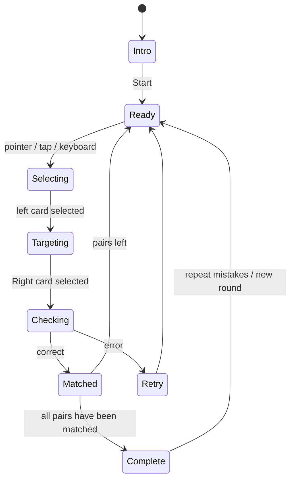

# Game 01: Couples - Redesign Specification

Status: renderer implemented on desktop and mobile; The editor supports 2–8 structured pairs, media slots on both sides, rearrangement, duplication and deletion of lines.

## 1. Learning goal

“Pairs” train the recognition of a stable connection between two entities. The student should not guess by position: he compares the meaning of both parts and clearly connects the correspondence.

Suitable subject connections:

- term ↔ definition;
- word ↔ translation;
- expression ↔ value;
- value ↔ formula;
- formula ↔ unit of measurement;
- event ↔ date;
- author ↔ work;
- object ↔ property;
- cause ↔ effect only if the connection is unambiguous;
- question ↔ short answer.

Not suitable:

- long arguments;
- many-to-many relationships;
- subjective categories;
- pairs that differ only in minor design;
- assignments where both columns contain almost identical long paragraphs.

## 2. Canonical Content Model

```ts
type MatchPair = {
  id: string
  left: string
  right: string
  leftMedia?: LearningImage
  rightMedia?: LearningImage
  explanation?: string
}

type LearningImage = {
  kind: 'image'
  src: string
  alt: string
  name: string
  width: number
  height: number
}

type MatchPairsActivity = {
  title: string
  instruction: string
  subject: string
  audience: string
  pairs: MatchPair[]
  roundSize: 2 | 3 | 4 | 5 | 6 | 7 | 8
}
```

Each side supports three compositions: text only, image only, image with caption. In MVP, the file is shrunk in the browser, converted to WebP, and sent to Level JSON as a data URL. The production version will replace the data URL with the URL of an object in S3/R2-compatible storage without changing the game contract. Audio is added later as a separate content option.

## 3. Mechanics of creating variations

### 3.1. Manual creation

The editor shows separate rows with columns "Left Side" and "Right Side". Each cell contains text, an image button, a preview, a replacement, a delete, and an available description. The teacher can:

- add 2–8 pairs in one MVP round;
- insert rows from table;
- raise, lower, duplicate or delete a single pair;
- edit a single pair;
- use text, image or a combination thereof on any side;
- exclude a couple from a particular round;
- run ambiguity check.

### 3.2. AI creation

Input parameters:

- item;
- topic;
- level or age;
- response language;
- number of pairs;
- learning goal;
- desired type of connection;
- additional teacher restriction.

AI returns only data from the approved schema. After generation, the server checks:

1. number of pairs;
2. uniqueness `id`;
3. no empty sides;
4. absence of duplicates after normalization of case and spaces;
5. unambiguity of right answers;
6. reasonable length of cards;
7. compliance with the subject and level;
8. having a short explanation for potentially complex connections;
9. The length of each text side is no more than 160 characters.

The AI ​​does not select the cards' location, color, speed or correct coordinates. This is the responsibility of the renderer.

### 3.3. Deterministic round variations

Different rounds are created from one set without repeated AI generation:

- is selected `roundSize` steam;
- pairs are selected by seed so that the round can be replayed;
- the order of the left and right columns is shuffled independently;
- the same positional combination is not repeated two rounds in a row;
- errors from the previous attempt receive priority in the next round;
- The direction can be expanded entirely: `left ↔ right`;
- Within one round, the direction of individual cards does not mix.

### 3.4. Feeding modes

For the first release, there are two compatible modes:

1. **Connections.** All cards are visible at the same time, the student connects the left and right columns.
2. **Focus.** One card on the left is highlighted, the student selects the corresponding one on the right; Suitable for telephone and long text.

Both modes use the same data and the same calculation of the result. Memory with closed cards remains a separate game.

## 4. Basic game mechanics of "Connection"

### Start

- the title, short instructions and demonstration of one connection are visible;
- the “Start” button is the only main action;
- The timer does not go until pressed.

### Move

1. The student grabs the card or its magnetic assembly on the left.
2. The card rises slightly, making available targets on the right more prominent.
3. There is an elastic line behind the pointer.
4. When you hover over the right card, a magnetic attraction appears.
5. Once released, the connection is checked.

Additional controls:

- tap on the left card, then tap on the right;
- keyboard: select a card, move between targets using arrows, confirm Enter/Space;
- reselecting a connected card allows you to change the answer before the final check if delayed feedback is enabled.

### Correct connection

- the line is gently fixed;
- both cards receive a thin green outline and a common number/symbol;
- a short quiet signal sounds;
- cards remain readable;
- progress increases by one pair.

### Wrong connection

For instant check:

- the line becomes coral at 250–300 ms;
- cards deviate briefly from each other;
- the connection returns to its original state;
- the phrase “These cards are not connected - try another” appears;
- the correct answer is not revealed automatically.

In quiet mode for adults, you can use a delayed check: the lines are fixed neutral, and the “Check” button evaluates the entire set.

### Completion

The round ends when all pairs are connected correctly. The lines are collected into a neat overall composition, then the result appears:

- number of correct connections;
- number of attempts;
- accuracy;
- elapsed time if the timer is enabled;
- action “Repeat errors”;
- action "Next round".

## 5. State machine



The pause state is available from `Ready`, `Selecting` and `Targeting`. After returning, the incomplete drag line is reset, already confirmed pairs are saved.

## 6. Calculating the result

```text
accuracy = correctConnections / connectionAttempts × 100
completion = matchedPairs / totalPairs × 100
```

- `connectionAttempts` increases after each completed pair selection;
- a canceled drag outside the card is not considered an attempt;
- in deferred mode, each connection at the time of verification is considered an attempt;
- score is a secondary representation, attempt stores the original metrics;
- speed should not reduce the learning result if the teacher has turned off the timer.

## 7. Desktop layout composition

- The game world remains expressive around the edges, but the central zone of the mission maintains an even contrast;
- compact top HUD without side panels;
- title and one line of instructions to the left above the scene;
- two columns of four large white cards;
- wide, calm central area for lines;
- progress `2 of 4` in a compact pill;
- one active turquoise blue connection;
- one already assembled green connection;
- corgi coach with a short context clue below, not blocking the scene;
- no score sheets, editor or teacher menu.

Approved visual references:

- `mockup-desktop-v3.png` — a game scene with pictures inside the cards;
- `editor-media-slots-v1.png` — an editor with separate media slots for each side of the pair.

Example content for the layout - adult Business English B1:

- `meet the deadline` ↔ `meet the deadline`;
- `push the meeting back` ↔ `reschedule the meeting for a later time`;
- `keep me posted` ↔ `keep me updated`;
- `wrap things up` ↔ `finish and summarize`.

This example immediately checks that the style does not look childish and that the cards can withstand different text lengths.

## 8. Adaptation for phone

At widths up to 679 px, the “Focus” mode becomes standard:

- one active card on top;
- three to four answers vertically;
- tap without mandatory drag;
- progress and pause remain in the top line;
- the line is replaced by a short magnetic movement of the selected answer;
- You can enable desktop communications mode on your tablet if the actual width of the scene is sufficient.

## 9. Availability

- cards are DOM buttons, and lines are a visual layer;
- connected pairs have a common symbol and text state, not just a common color;
- keyboard focus order matches visual order;
- live region reports “Pair collected” or error text;
- formulas receive a text description;
- minimum click zone – 44 × 44 px;
- reduced motion saves all states without physically moving.

## 10. What is deliberately not included in the first redesign

- audio and video inside cards;
- joint play of several students;
- arcade-wrapper;
- leaderboard;
- complex combo system;
- freely draw lines between any objects;
- automatic publication of AI content.

## 11. Visual confirmation criteria

Before layout you need to confirm that:

- the screen is perceived as a modern game, and not an administrative form;
- it does not look childish or “office”;
- cards and connections are read in one second;
- the composition supports Russian and English text of different lengths;
- The HUD does not compete with the mission;
- the style can be transferred to “Groups”, “Quiz” and “Memory Deck”;
- the decorative background does not impair the contrast;
- the layout is specific enough to be reproduced in DOM/CSS.

## 12. Implemented version

The Renderer is built on available DOM buttons and a separate SVG link layer. Correctness is determined only by identifiers `level.pairs`, so the location of the cards and the generated references do not affect the learning response.

Desktop mode supports:

- select left and right cards by clicking or tap;
- real drag from the magnetic node of the left card to the right;
- lines calculated from the actual coordinates of DOM elements;
- separate states of choice, correct, incorrect and completed connection;
- recalculation of lines when changing scene sizes;
- pause, reset and save already confirmed pairs.
- text, image, or captioned image on both sides of the pair;
- automatic reduction of the user image to a safe size;
- server-side verification of type, source length, dimensions and alternative description.

At a width of up to 680 px, the “Focus” mode is automatically turned on: one original card, four large answers and an explicit “Next Pair” button. It uses the same data, validation and calculation as desktop.

Scenarios tested:

1. correct connection and green confirmation;
2. faulty communication and red dotted feedback;
3. drag connection;
4. completion of round 4/4;
5. reset;
6. correct mobile answer and move to the next pair on viewport 390 × 844;
7. production build and ESLint without errors.

An additional check by the editor confirmed the presence of eight independent media slots for four pairs and a live preview update via the same Level JSON. Automatic file transfer through the system chooser of the current built-in browser is not available, so full upload-smoke remains a separate manual check.
